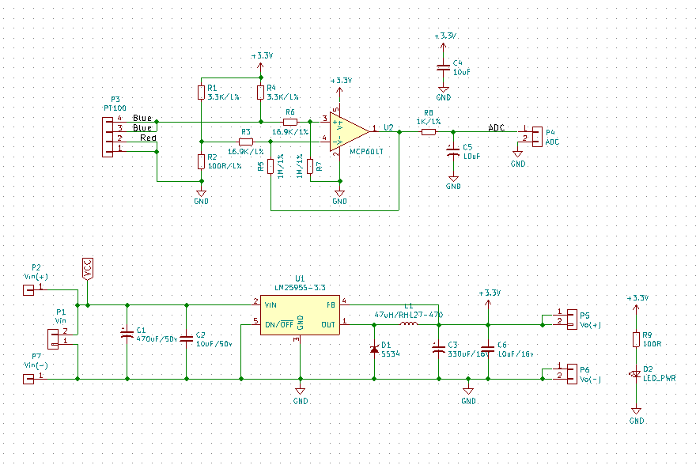
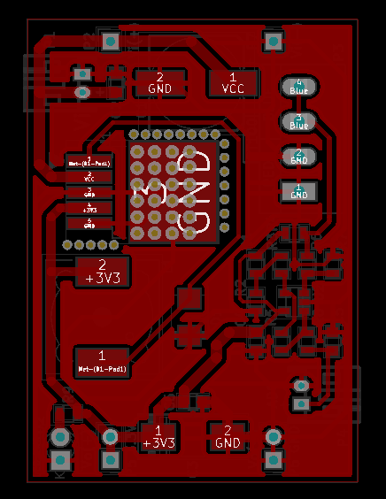

# VM-sensor-PT1000

## Hardware

### Schematics

### PCB Layout

### 3D

### Gerber

[Download](./assets/gerber.zip)

### BOM 
| Id | Designator  | Package                              | Quantity | Designation                      |
|----|-------------|--------------------------------------|----------|----------------------------------|
| 1  | U1          | TO-263-5Lead                         | 1        | LM2595S-3.3                      |
| 2  | U2          | SOT-23-5                             | 1        | MCP601T                          |
| 3  | D1          | do214aa-g                            | 1        | SS34                             |
| 4  | D2          | LED-3MM                              | 1        | LED_Small                        |
| 5  | L1          | Choke_SMD_12x12mm_h8mm               | 1        | 47uH/RH127-470                   |
| 6  | C1          | c_elec_10x10.5 Aluminum              | 1        | 470uF/50v                        |
| 7  | C3          | Tantalum_Case-D_EIA-7343-31_Hand     | 1        | 330uF/16V                        |
| 8  | C4,C5,C6    | C_0805                               | 3        | 10uF/16v                         |
| 9  | C2          | C_0805                               | 1        | 10uF/50v                         |
| 10 | R1,R4       | R_0805                               | 2        | 3.3K/1%                          |
| 11 | R2          | R_0805                               | 1        | 100R/1%                          |
| 12 | R3,R6       | R_0805                               | 2        | 16.9K/1%                         |
| 13 | R5,R7       | R_0805                               | 2        | 1M/1%                            |
| 14 | R8          | R_0805                               | 1        | 1K/1%                            |
| 15 | R9          | R_0805                               | 1        | 100R                             |
| 16 | P3          | Domino-PT100.pretty                  | 1        | 4P-3.81 Pluggable Terminal Block |
| 17 | P2,P5,P6,P7 | Pin_Header_Straight_1x01_Pitch2.54mm | 4        | Male header, Pitch: 2.54MM       |
| 18 | P4,P1       | s2b-ph-kl                            | 2        | WB2F-L40P2.54                    |